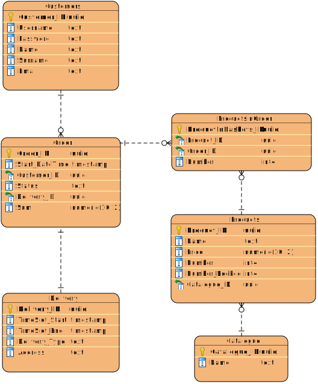
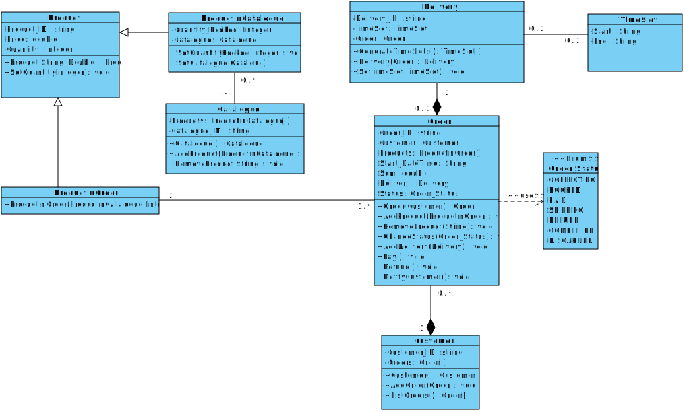

# Требования к проекту  
## Функциональные требования:
### Корзина:
1. Пользователь может просматривать каталог
2. Пользователь может добавлять товары в корзину
3. Пользователь может оформить заказ из товаров в корзине
4. При оформлении заказа товары бронируются на складе
5. При оформлении заказа пользователь может указывать детали
6. Пользователь может изменить состав заказа на этапе оформления
7. При изменении состава заказа на этапе оформления, необходимо начать процесс оформления заново
#### Взаимодействие с внешней системой (корзина):
1.	Система должна отслеживать время сбора корзины
2.	Система должна оповещать пользователя через внешнюю систему о «брошенной» корзине и предоставлять ссылку на не сформированный заказ
3.	Если заказ не оформлен через определённое время, он переводится в категорию отменённых
### Доставка:
1.	Пользователь может выбрать способ получения заказа
2.	Пользователь может выбрать временной слот для доставки из доступных
3.	Пользователь должен произвести оплату доставки после выбора параметров
4.	При не произведении доставки вовремя, производится возмещение
#### Взаимодействие с внешней системой (доставка):
1.	Запросы по доставке отправляются во внешнюю систему
2.	Должна производится генерация слотов доставки в соответствии с параметрами магазина и внешней системы
3.	После оплаты система должна передавать информацию системе доставки
4.	Система должна подобрать вариант доставки под выбранный слот доставки
5.	Если был сгенерирован невозможный слот, производится возмещение
### Оплата заказа:
1.	После оформления заказа пользователь должен его оплатить
2.	Если оплата заказа не была произведена в определённый срок, то бронь товаров из заказа автоматически снимается
3.	Если заказ не был облачен в отведённое время после оформления, то он не подлежит оплате и требует повторного оформления
#### Взаимодействие с внешней системой (оплата):
1.	Для оплаты внешней системе передаются данные о пользователе и сумма заказа
2.	Если у пользователя недостаточно денег, то оплата не производится
3.	Если оплата не проходит из-за ошибки внешней системы, то необходимо попробовать другой аккаунт внешней системы
## Нефункциональные требования:
1.	Надёжное межпроцессное взаимодействие
2.	Устойчивость к отказу отдельных элементов системы
3.	Устойчивость к отказу и нестабильной работе внешних систем
4.	Обращение к внешней системе через протокол HTTP
5.	Возможность обращаться к внешней системе синхронно, основанное на обратных вызовах или через пуллинг
6.	Минимизация количества запросов к внешней системе
7.	Логирование всех обращений к внешней системе
8.	Наличие публичного API
9.	Подтверждение получения пользователем оповещения о брошенной корзине
10.	Подтверждение передачи информации системе доставки
11.	Подтверждение получения статусов оплаты из внешней системы
12.	Система должна быть разделена на логические модули по исполняемым функциям
13.	Архитектура системы должна быть описана в документации
14.	Безопасная передача данных во внешнюю систему
## Архитектура данных

## Программная архитектура

## API системы
[Документация](./docs/api_documentation.md)
## Ubiquitous language
[Словарь](./docs/ubiquitous_language.md)
## Events
[Документация событий](./docs/events_documentation.md)
