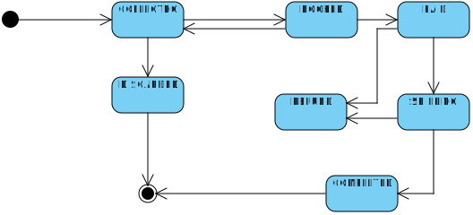

# Events documentation
## Entities:
- Product
  - Product_ID – entity identity 
  - Price 
  - Name 
  - Quantity 
- ProductInOrder
- ProductInCatalogue
  - QuantityBooked 
  - Catalogue 
- Catalogue
  - Catalogue_ID – entity identity 
  - Name 
  - Products 
- Order 
  - Order_ID – entity identity 
  - Customer 
  - Products 
  - Start_DateTime 
  - Delivery 
  - Status 
- Delivery
  - Delivery_ID – entity identity 
  - TimeSlot: Start, End – value object. 
  - Order 
  - Delivery_Type 
  - Adders 
- Customer 
  - Customer_ID – entity identity 
  - Username 
  - Password 
  - Name 
  - Surname 
  - Email 
  - Orders

## Aggregates:
- Product + ProductInOrder + ProductInCatalogue. 
  - ∀ ProductInCatalogue.quantity ≥ 0
  - ∀ ProductInCatalogue.quantity_booked ≥ 0
  - ∀ ProductInOrder.quantity ≥ 0
  - ∀ ProductInCatalogue.quantity + ProductInCatalogue.quantity_booked before order booking = ProductInCatalogue.quantity + ProductInCatalogue.quantity_booked after order booking,   
- Catalogue 
- Order
  - Order.Sum ≥ 0, 
  - Order.Status according to the state machine
  

- Delivery
  - TimeSlot.Start < TimeSlot.End
  - TimeSlot.Start > CurrentDate
- Customer
## Events:
- Product:
  - CreatedProduct
  - QuantitySet
  - CreatedProductInOrder
  - CreatedProductInCatalogue
  - QuantityBookedSet
- Catalogue
  - CreatedCatalogue
  - ProductAdded
  - ProductRemoved
- Order
  - CreatedOrder
  - ProductAdded
  - ProductRemoved
  - StatusChanged
  - DeliveryAdded
  - Paid
  - Refunded
  - CustomerNotified
- Delivery
  - CreatedDelivery
  - GeneratedTimeSlot
  - TimeslotSet
- Customer 
  - CreatedCustomer
  - OrderAdded
## Commands:
- Product
  - CreateProduct
  - SetQuantity
  - CreateProductInOrder
  - CreateProductInCatalogue
  - SetQuantityBooked
- Catalogue
  - CreateCatalogue
  - AddProduct
  - RemoveProduct
- Order
  - CreateOrder
  - AddProduct
  - RemoveProduct
  - ChangeStatus
  - AddDelivery
  - Pay
  - Refund
  - NotifyCustomer
- Delivery
  - CreateDelivery
  - GenerateTimeSlot
  - SetTimeslot
- Customer
  - CreateCustomer
  - AddOrder

